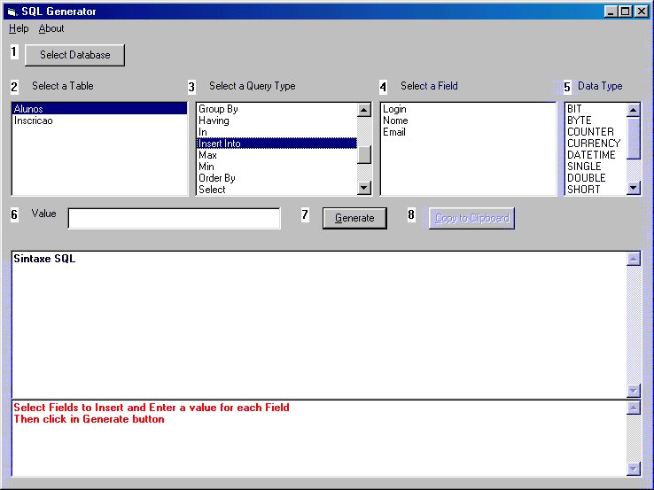



## SQL Code Generator V2

### Description

Select a database and a table and receive the sintaxe SQL to: Add Field, Alter Field, Avg, Count, Create Index, Create IndexUnique, Delete, Distinct, DistinctRow, Drop Field, Drop Index, Drop Table, Group By, Having, In, Insert Into, Max, Min, Order By, Select, StDev, StDevP, Sum, Top, Update, Var or VarP.
 
### More Info
 
Select a database name and a table.

Help online.

Return a sintaxe SQL to: Add Field, Alter Field, Avg, Count, Create Index, Create IndexUnique, Delete, Distinct, DistinctRow, Drop Field, Drop Index, Drop Table, Group By, Having, In, Insert Into, Max, Min, Order By, Select, StDev, StDevP, Sum, Top, Update, Var or VarP.

This program is free and open source. I like to receive bugs reports.

             |
---                |---
**Submitted On**   |2001-12-29 19:46:28
**By**             |[Ribamar FS](https://github.com/Planet-Source-Code/PSCIndex/blob/master/ByAuthor/ribamar-fs.md)
**Level**          |Beginner
**User Rating**    |4.9 (44 globes from 9 users)
**Compatibility**  |VB 5\.0, VB 6\.0, ASP \(Active Server Pages\) 
**Category**       |[Complete Applications](https://github.com/Planet-Source-Code/PSCIndex/blob/master/ByCategory/complete-applications__1-27.md)
**World**          |[Visual Basic](https://github.com/Planet-Source-Code/PSCIndex/blob/master/ByWorld/visual-basic.md)
**Archive File**   |[SQL\_Code\_G4463712292001\.zip](https://github.com/Planet-Source-Code/ribamar-fs-sql-code-generator-v2__1-30211/archive/master.zip)

